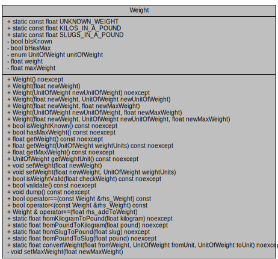

# Fat Cat


Every animal has a weight.  The good thing about weight is that it’s easy to understand — and that makes it good to model.

Learning to build a good model is a cornerstone of object oriented programming.  On one hand it tends to require a lot of code.  The `.h` file for my Weight model is 125 lines long (including documentation) and the `.cpp` file is 400 lines.  On the other hand, the code is fairly easy to write.

In Fat Cat, we will implement a replacement for Weight.  This field started as a `float`, migrated to a `typedef` of a float and now we will migrate it to a `class`.

You will start by creating a brand-new repository called **ee205-lab12a-fatCat**.  We will develop Weight in it’s own repo and then when it’s done-and-tested, we will bring it over to Animal Farm.

I have published a copy of my reference code’s documentation here:

http://www2.hawaii.edu/~marknels/ee205/ee205_lab12a_fatCat/index.html

However, there is no source code this time — you’re a bit more on your own — but you’ll be fine.  Remember:  CLion has a Generate capability and you should learn to use it.


### Weight has the following rules:
  - Weight holds the weight as a `float`, which can never be <= 0.  However, the weight may be unknown.  Once it is known, it will always have a value (you can’t un-know a weight).
  - Weight can be held in one of 3 units:  POUNDs, KILOs or SLUGs.  It defaults to POUND.  Once the unit of measure is set, it can’t be changed.  Weight can be retrieved and set in another unit — so you may need to revive code from CatPower to do unit conversions.
  - Most animals have a maximum weight.  Once it’s set, it can’t be changed.



---
### Tips and Tricks
  - Declare methods that don’t modify the class as `const`
  - Declare methods that don’t throw exceptions as `noexcept`
  - The documentation has 2 really good parts:
    - The Weight class, especially the section titles, will tell you how to declare things:  Static Public, Private, etc.
    - Weight.h (in Files) has all of the documentation for the `<<` operators
  - Use your `main()` function to thoroughly test your Weight class

### Starters
  - Remember to keep track of the time you spend on this lab

### Enum
You can declare an `enum` as a Global or as an enum inside of a `class`.  I did the latter.

```
class Weight {
public:  ////////////// Enumerations //////////////
    /// A unit of measure for weight
   enum UnitOfWeight { POUND, KILO, SLUG };
```
Then, I added the conversion constants:
```
static const float KILOS_IN_A_POUND ;
static const float SLUGS_IN_A_POUND ;

```
…and some labels
```
static const std::string POUND_LABEL ;  
static const std::string KILO_LABEL ;       
static const std::string SLUG_LABEL ;
```
Because these are class-constants, they need to be defined in the .cpp file:
```
const float Weight::KILOS_IN_A_POUND = 0.453592 ;
```

### Static Methods
Static methods are associated with the class, not the instance of the class.  For example:

.h code:
```
static float fromKilogramToPound( float kilogram ) noexcept;
```

.cpp code:
```
float Weight::fromKilogramToPound( const float kilogram ) noexcept {
   return kilogram / KILOS_IN_A_POUND ;
}
```

Notice how the conversion relies only on constants and parameters?  It does not use any member variables.  When a method doesn’t need any members but is still associated with the class, then we can make it `static`.

I found this `static` method to be quite handy:
```
static float convertWeight( float        fromWeight
                           ,UnitOfWeight fromUnit
                           ,UnitOfWeight toUnit ) noexcept;
```

Because `static` methods can’t access the member functions, they are automatically `const` functions.

### Constructors
There’s 7 constructors for Weight… and two fields can only be set in the constructor (maxWeight and unitOfMeasure).  There may be times when you want to call one constructor from another.  One way to do it is like this (zoom in):
```
/// Once UnitOfWeight is set, it can't be changed.
/// Once maxWeight is set, it can't be changed.
Weight::Weight( const Weight::UnitOfWeight newUnitOfWeight, const float newMaxWeight ) : Weight( newUnitOfWeight ) {
   setMaxWeight( newMaxWeight );
   assert( validate() );
}
```

### The Put To << operator
The `<<` operator is called Put To.  You would think that if you wanted to override `<<` for Weight or enum UnitOfWeight, you would override them in the class.  It ends up that you write the `<<` as a global polymorphic function (not a class override).  Here’s how one looks:
```
std::ostream& operator<<( ostream& lhs_stream
,const Weight::UnitOfWeight rhs_UnitOfWeight ) {
   switch( rhs_UnitOfWeight ) {
      case Weight::POUND: return lhs_stream << Weight::POUND_LABEL ;
      case Weight::KILO:  return lhs_stream << Weight::KILO_LABEL ;
      case Weight::SLUG:  return lhs_stream << Weight::SLUG_LABEL ;
      default:
         throw out_of_range( "The unit can’t be mapped to a string" );
   }
}
```

I use `lhs` and `rhs` as shorthand for Left Hand Side and Right Hand Side.

Now, when you do this…
```
UnitOfWeight unitOfWeight = Weight::KILO;
cout << unitOfWeight ;
```
…you get this:
```
Kilo
```

CLion has generators for these (called Stream Output Operator)… I’d suggest you use them.

### Overriding numeric operators
This lab asks you to override 3 numeric operators:  `==`, `<` and `+=`.

In truth, we are not fully implemented a good numeric class.  A full/complete implementation would have overrides for the following operators:

`=  -=  *=  /=  %=  ++  --  +  -  *  /  >=  >  <=  !=`  and  `<=>`

…which would add several hundred lines of code and allow you to intuitively do math with a Weight class (i.e. `catWeight++`).  Once you’ve done the first few operators, the others are relatively easy to implement.  I don’t think it’s a good use of your time to fully implement everything right now.

CLion has generators for `==` (**Equality Operators**) and `<` (**Relational Operators**).

Here’s an implementation for `==`
```
bool Weight::operator==( const Weight& rhs_Weight ) const {
   /// Remember to convert the two weight's units into a common unit!
   /// Treat unknown weights as 0 (so we can sort them without dealing    
   /// with exceptions)
   float lhs_weight = (bIsKnown) ? getWeight(Weight::POUND) : 0;
   float rhs_weight = (rhs_Weight.bIsKnown) ?  
   rhs_Weight.getWeight(Weight::POUND) : 0;

   return lhs_weight == rhs_weight;
}
```

The `?` operator is pretty cool…. It’s a conditional evaluator:
(some test) `?` (use if test is true) `:` (use if test is false)

… and here’s a prototype for the `+=` operator
```
Weight& operator+=( float rhs_addToWeight );
```

### Wrapping Up
When you think you’re finished… use this checklist to close out this lab
- Re-read the spec (the website)
- Thoroughly test your code against all of the conditions in the spec
- Make sure the indentation in the source code looks good
- Check your comments and program header blocks
- Look for any `@todo` or debugging code that should be commented out
- No compilation warnings
- The code is professional and ready for another competent C programmer to review
- All work is committed and pushed to GitHub
- You have submitted your GitHub repo URL in Laulima

### Final Thoughts
This should not be a “Major lab”.  Don’t overthink it.  Just read through each line method in the documentation, implement it and test it.
